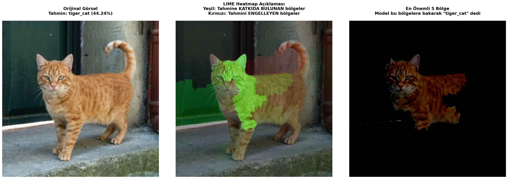
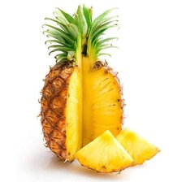
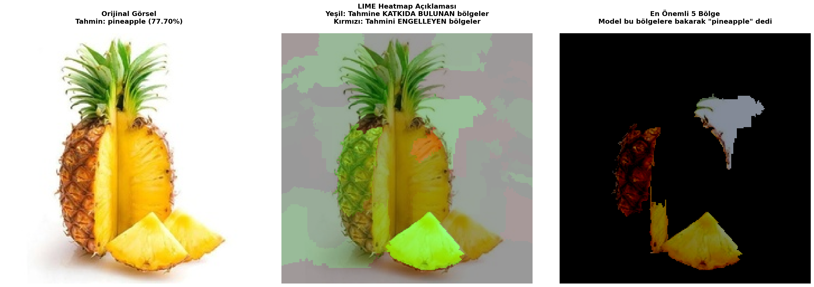
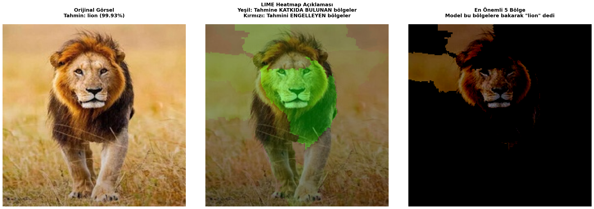

# LIME Demo - Görsel Sınıflandırma Açıklaması

Bu proje, **LIME (Local Interpretable Model-agnostic Explanations)** kullanarak ResNet50 derin öğrenme modelinin görsel sınıflandırma kararlarını açıklamak için oluşturulmuştur.

## 📋 Proje Açıklaması

LIME, karmaşık makine öğrenmesi modellerinin tahminlerini anlamak ve yorumlamak için kullanılan bir açıklama tekniğidir. Bu projede:

- **ResNet50** önceden eğitilmiş model kullanarak görselleri sınıflandırır
- **LIME** algoritması ile her sınıflandırmanın nedenini görselleştirir
- Hangi görsel bölgelerinin tahmine katkı sağladığını (pozitif/negatif) renk haritasıyla gösterir
- GPU desteği ile hızlı işlem sağlar

## 📁 Proje Yapısı

```
LIME_DEMO/
├── lime_demo.py              # Ana uygulama (LIME açıklama motoru)
├── resize_images.py          # Görselleri 224x224 boyutuna dönüştüren script
├── gpu_info.py              # Sistem GPU/CPU bilgilerini gösteren script
├── requirements.txt          # Python bağımlılıkları
├── kaynak_gorseller/         # Orijinal görsellerin bulunduğu klasör
├── kaynak_gorseller_224x224/ # Yeniden boyutlandırılmış görseller (224x224)
└── lime_ciktilar/           # LIME sonuçlarının kaydedildiği klasör
    ├── [image_name]_lime_explanation.png
    ├── [image_name]_heatmap.png
    └── [image_name]_full_comparison.png
```

## 🛠️ Kurulum

### 1. Gerekli Paketleri Yükleyin

```powershell
pip install -r requirements.txt
```

**Bağımlılıklar:**
- `numpy` - Sayısal hesaplamalar
- `matplotlib` - Görselleştirme
- `scikit-image` - Görsel işleme
- `Pillow` - Görsel yükleme/kaydetme
- `tensorflow` - Derin öğrenme (ResNet50 modeli)
- `lime` - Açıklama algoritması

### 2. GPU Desteği (Opsiyonel ancak Önerilen)

Hızlı işlem için NVIDIA GPU kullanabilirsiniz:

```powershell
# TensorFlow GPU sürümünü kurun
pip install tensorflow-gpu

# CUDA 12.x ve cuDNN kurulumundan sonra
```

GPU durumunu kontrol etmek için:

```powershell
python gpu_info.py
```

## 📸 Kullanım

### Adım 1: Görselleri Hazırlamak

Orijinal görselleri `kaynak_gorseller` klasörüne yerleştirin, ardından yeniden boyutlandırın:

```powershell
python resize_images.py
```

Bu script:
- Tüm görselleri 224x224 piksel boyutuna dönüştürür
- PNG dosyalarını RGB JPG formatına çevirir
- Görselleri rastgele sırada yeniden adlandırır
- Yeniden boyutlandırılmış görselleri `kaynak_gorseller_224x224` klasörüne kaydeder

### Adım 2: LIME Açıklamasını Çalıştırmak

```powershell
python lime_demo.py
```

Bu script:
- ResNet50 modelini yükler
- Her görsel için sınıflandırma tahmini yapar
- LIME algoritmasını çalıştırarak açıklamalar oluşturur
- Sonuçları `lime_ciktilar` klasörüne kaydeder

## ⚙️ Konfigürasyon

`lime_demo.py` dosyasındaki ayarları değiştirebilirsiniz:

```python
SOURCE_FOLDER = 'kaynak_gorseller_224x224'  # Girdi görselleri
OUTPUT_FOLDER = 'lime_ciktilar'             # Çıktı klasörü
NUM_SAMPLES = 1000                          # LIME pertürbasyon örnek sayısı
TOP_CLASSES = 5                             # En iyi N tahmini göster
EXPLANATION_CLASS_INDEX = None              # Açıklanacak sınıf (None = en iyi tahmin)
```

## 📊 Çıktı Dosyaları

Her görsel için üç dosya oluşturulur:

1. **`[image_name]_lime_explanation.png`**
   - LIME tarafından oluşturulan semented bölgeler
   - Her bölgenin tahmini etkileme katsayısı

2. **`[image_name]_heatmap.png`**
   - Yeşil: Sınıflandırmaya olumlu katkı
   - Kırmızı: Sınıflandırmaya olumsuz katkı
   - Koyu renk: Az etki, Açık renk: Çok etki

3. **`[image_name]_full_comparison.png`**
   - Orijinal görsel + LIME açıklaması + Heatmap yan yana
   - Model tahminleri ve güven seviyeleri

## 🔍 LIME Nasıl Çalışır?

1. **Segmentasyon**: Görsel bölgelere bölünür (superpixel)
2. **Pertürbasyon**: Bölgeler rastgele kapatılır (000 örnekle)
3. **Tahmin**: Her pertürbe edilmiş görsel için model tahmin yapar
4. **Doğrusal Model**: Bölge-tahmin ilişkisini açıklayan doğrusal model eğitilir
5. **Görselleştirme**: En etkili bölgeler renklendirilir

## 💻 Sistem Gereksinimleri

- **Python**: 3.7+
- **Bellek**: Minimum 4GB (GPU kullanıyorsanız 8GB+ önerilen)
- **GPU**: NVIDIA GPU (CUDA 12.x destekli, optional)
- **İşletim Sistemi**: Windows, Linux, macOS

## 🚀 Örnek Çalıştırma

```powershell
# 1. Görselleri hazırla
python resize_images.py

# 2. GPU durumunu kontrol et
python gpu_info.py

# 3. LIME analizi çalıştır
python lime_demo.py

# 4. Sonuçları görüntüle
# lime_ciktilar/ klasöründeki PNG dosyalarını aç
```

## ⚡ Performans İpuçları

- **GPU kullanın**: CPU'dan 10-50x daha hızlı
- **NUM_SAMPLES'ı azaltın**: Daha hızlı işlem (daha az doğruluk)
- **Batch işlem**: Birden fazla görsel için döngüyü optimize edin

## 📝 Analiz Sonuçları Örnekleri

### Örnek 1: Kedi (Tiger Cat)
**Orijinal Görsel:**


**LIME Açıklaması:**


---

### Örnek 2: Ananas (Pineapple)
**Orijinal Görsel:**


**LIME Açıklaması:**


---

### Örnek 3: Aslan (Lion)
**Orijinal Görsel:**


**LIME Açıklaması:**


---

## 📝 Terminal Çıkış Örneği

```
============================================================
GPU/CPU Durum Kontrolü
============================================================
✅ 1 adet GPU bulundu ve etkinleştirildi:
   - /physical_device:GPU:0

============================================================
Görsel Sınıflandırma ve LIME Açıklaması Başladı
============================================================

[1/25] Görsel işleniyor: image_001.jpg
  🔍 Model Tahminleri:
     1. Sınıf: dog (0.92)
     2. Sınıf: animal (0.05)
     3. Sınıf: mammal (0.02)
  📊 LIME açıklaması oluşturuluyor...
  💾 Kaydedildi: lime_ciktilar/image_001_full_comparison.png
```

## 🐛 Sorun Giderme

**Problem**: GPU bulunamadı
```powershell
# Çözüm: CUDA ve cuDNN doğru şekilde yüklenmiş mi kontrol edin
python gpu_info.py
```

**Problem**: "Out of Memory" hatası
```powershell
# Çözüm: NUM_SAMPLES'ı azaltın veya görselleri küçültün
NUM_SAMPLES = 500  # 1000'den 500'e
```

**Problem**: Modeli yüklerken hata
```powershell
# Çözüm: TensorFlow'u yeniden kurun
pip install --upgrade tensorflow
```

## 📚 Kaynaklar

- [LIME Paper](https://arxiv.org/abs/1602.04938) - Ribeiro et al., 2016
- [TensorFlow Belgeleri](https://www.tensorflow.org/api_docs)
- [LIME GitHub](https://github.com/marcotcr/lime)

## 📄 Lisans

Bu proje eğitim ve araştırma amaçlı oluşturulmuştur.

---

**Hazırlayan**: LIME Demo
**Tarih**: Aralık 2025
